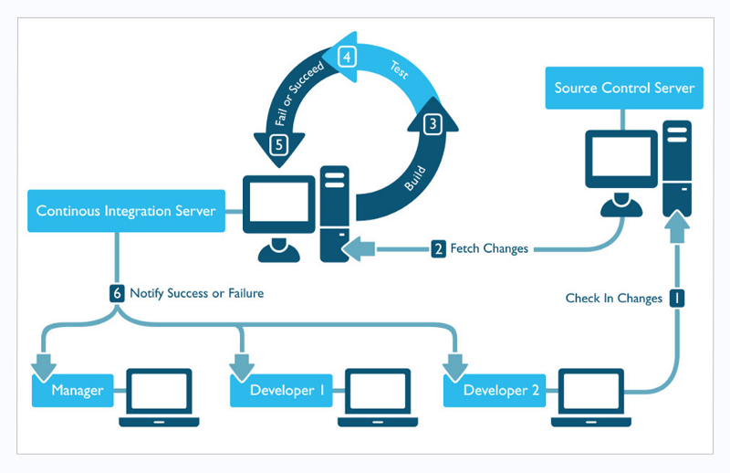
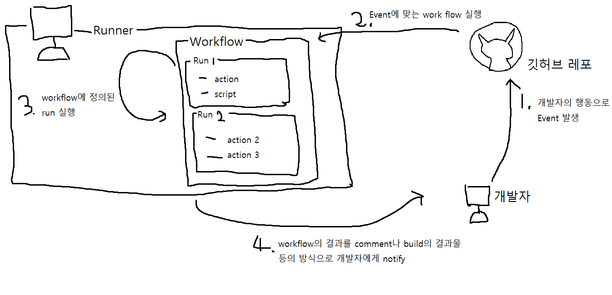

# CI/CD, github action에 대한 공부, 실습 레포입니다.

----
- [CI/CD, github action에 대한 공부, 실습 레포입니다.](#ci-cd--github-action-----------------)
  * [CI/CD?](#ci-cd-)
    + [CI (지속적 통합)](#ci---------)
      - [어떻게 그게 가능한가요?](#-------------)
    + [CD](#cd)
  * [Github Actions?](#github-actions-)
  * [Github Actions 의 구성 요소](#github-actions--------)
    + [Workflow](#workflow)
    + [Event](#event)
    + [Runner](#runner)
    + [Job](#job)
    + [Action](#action)
  * [내가 이해한 Github action의 흐름](#-------github-action----)
  * [레퍼런스](#----)

<small><i><a href='http://ecotrust-canada.github.io/markdown-toc/'>Table of contents generated with markdown-toc</a></i></small>


----
## CI/CD?

### CI (지속적 통합)
- CI란 continuous Integration 의 약자로, **지속적 통합**이라는 의미를 지닌다.
- 현대의 개발은 각기 다른 개잘자가 각기 다른 기능을 동시에 작업한다.
  - 그렇게 때문에, master 나 develop 과 같은 공유 브랜치에 병합을 하는 일 충돌을 일으키고, 그로인해 반복적인 수작업이 발생하게 된다.
  - **CI는 이런 문제를 보다 수월하고, 자주 수행할 수 있도록 도와준다.**
  - **어떻게 그게 가능한가요?**
    - 병합이 일어났을 때 자동화된 테스트를 실행하는 것을 통해 이런 문제를 수월하게 해준다.
    - CI를 하면 변경사항이 병합 될 때 모든 클래스, 기능, 서로다른 모듈에 대한 테스트를 자동화 하여 실행하기 때문에, 개발자들의 반복적인 수작업이 자동화 되고, 코드 충돌의 버그를 도욱 빠르게 수정할 수 있게 된다.
- ci 과정에 대한 전체적인 이미지는 다음과 같다.

1. 개발자는 기능을 개발하고 소스컨트롤 서버에 올린다
2. 소스컨트롤 서버는 해당 변화 ci 서버로 fetch 한다.
3. ci 서버는 변화된 소스코드로 build, test를 진행하고, 성공 실패 여부를 알아낸다.
4. ci 서버는 개발자들에게 성공 실패 여부를 알려준다.

### CD
-추후 작성

## Github Actions?
- 깃허브에서 공식적으로 제공하는 개발 workflow 자동화 도구
- push, Pull Request 등의 [이벤트](https://docs.github.com/ko/actions/using-workflows/events-that-trigger-workflows)에 따라 개발자가 정의한, 일련의 동작이 일어나도록 자동화 해준다.
- 주요 사용 목적
  1. CI/CD 
     - 테스트, 빌드, 배포를 자동화 하고 개발자들에게 결과를 알려줄 수 있다.
  2. cron job 
     -  레포지토리에대해 특정 시간에 스크립트를 반복 실행 시킬 수 있다.

## Github Actions 의 구성 요소

- github actions는 다음과 같은 [구성요소](https://docs.github.com/ko/actions/learn-github-actions/understanding-github-actions#the-components-of-github-actions)를 지닌다. 각각에 대한 한줄 정보는 아래와 같다.
  - [workflow](https://docs.github.com/ko/actions/learn-github-actions/understanding-github-actions#workflows) 
    - yml 파일로 나타낸 자동화된 커맨드 집합. 트리거 이벤트 정보, 실행될 job 등에 대한 내용을 포함하고 있다.
  - [Event](https://docs.github.com/ko/actions/learn-github-actions/understanding-github-actions#events) 
    - workflow를 실행 시키는 트리거 이벤트
  - [Runner](https://docs.github.com/ko/actions/learn-github-actions/understanding-github-actions#runners)
    - worklow에 정의된 job을 실행시키기 위한 환경(서버)
  - [Job](https://docs.github.com/ko/actions/learn-github-actions/understanding-github-actions#jobs)
    - Runner 안에서 실행되는 여러 단계(step)의 집합. 각각의 단계는 Action이나 sell 명령어가 된다.
  - [Action](https://docs.github.com/ko/actions/learn-github-actions/understanding-github-actions#actions)
    - github Actions 에서 사용하는 복잡하고 반복되는 task 를 자동화 시킨 application. 만들기 보다는 [Marketplace](https://github.com/marketplace?type=actions) 에서 가져와서 사용한다.
### Workflow
- yml 파일로 표현된 자동화된 커맨드의 집합
- 레포지토리의 `.github/workflows` 디렉토리에 저장된다.
- Build, Test, deploy등 역할에 맞는 workflow를 추가할 수 있다.
- trigger event와 그거에 해당하는 jobs로 구성된다.

예제
```yaml
# documentation.
# This workflow will build a Java project with Gradle and cache/restore any dependencies to improve the workflow execution time
# For more information see: https://docs.github.com/en/actions/automating-builds-and-tests/building-and-testing-java-with-gradle

name: Java CI with Gradle

on:
  push:
    branches: [ "develop" ]
  pull_request:
    branches: [ "develop" ]

permissions:
  contents: read

jobs:
  
  build:

    runs-on: ubuntu-latest

    steps:
    - uses: actions/checkout@v3
    - name: Set up JDK 11
      uses: actions/setup-java@v3
      with:
        java-version: '11'
        distribution: 'temurin'
    - name: Build with Gradle
      uses: gradle/gradle-build-action@67421db6bd0bf253fb4bd25b31ebb98943c375e1
      with:
        arguments: build


```
### Event
- workflow 를 실행시키는 github actions 의 이벤트
- Push, Pull request, Commit, 등의 github 내부 이벤트 뿐만 아니라, Repository dispatch webhook을 이용해 외부 이벤트도 event로 사용할 수 있다.
- 사용할 수 있는 이벤트 목록은 이 [링크](https://docs.github.com/ko/actions/using-workflows/events-that-trigger-workflows)에서 확인할 수 있다.
### Runner
- workflow에 정의되어 있는 Jobs 들을 실행시키기 위한 환경(서버) 
- 기본적인 Runner 깃헙에서 호스팅 하는 가상환경이 존재한다.
- 하지만 기본 Runner의 경우메모리, 용량제한등이 있다.
- 그렇기 때문에, 직접 호스팅하는 가상환경을 Runner 사용할 수도 있다.
### Job
- Runner안에서 실행되는 여러 단계(step)의 집합
- 하나의 workflow는 여러 job을 가진다.
- 기본적으로 같은 workflow 안의 job들은 동일한 runner에서 병렬적으로 실행된다.
- 필요에 따라 jobs 간의 의존관계를 설정해 순서를 지정해 줄 수 있다.
- job은 단계들(steps)로 구성되어 있으며 1개의 단계는 sell 명령어 혹은, action이 된다.
- 1개의 job속 step들은 순차적으로 실행된다.
### Action
- 깃허브 액션에서 사용하는 반복되고 복잡한 테스크를 진행하는 application
- 워크플로 파일의 반복되는 코드를 줄일 수 있다.
- 직접 작성하는 것도 가능하고, 마켓플레이스에서 받는것도 가능하다.
- 일반적으로는 마켓플레이스에서 받아서 사용한다
## 내가 이해한 Github action의 흐름
내가 이해한 github action의 흐름은 다음 그림과 같다.

1. pull request 등의 활동으로 event trigger
2. 이벤트에 따라 깃헙 레포에 정의된 workflow 실행
3. Runner에서 workflow에 정의된 run을 단계(step)별로 실행
4. workflow의 결과물을 comment나 build의 산출물 등으로 개발자에게 notify

아래와 같이 대응시킨 다면 앞서 정리한 CI사이클과 거의 일치하는 것을 확인할 수 있다.
- 소스컨트롤 서버 - 깃허브 레포
- CI 서버 - Runner


이것을 보며 github actions는 확실히 ci/cd에 특화되어 있구나 라는 느낌을 가지게 되었다.

## 레퍼런스
- [what is ci/cd?](https://www.redhat.com/ko/topics/devops/what-is-ci-cd)
- [Continuous Integration: A "Typical" Process](https://developers.redhat.com/blog/2017/09/06/continuous-integration-a-typical-process?cicd=32h281b&extIdCarryOver=true&sc_cid=701f2000001OH7EAAW)
- [깃허브actions 공식 문서](https://docs.github.com/ko/actions)
- [Github-Action을-이용한-CICD-개발-주기-자동화](https://velog.io/@youngerjesus/Github-Action을-이용한-CICD-개발-주기-자동화)
- [GitHub Actions를 이용한 CI/CD 구축하기](https://ji5485.github.io/post/2021-06-06/build-ci-cd-pipeline-using-github-actions/)